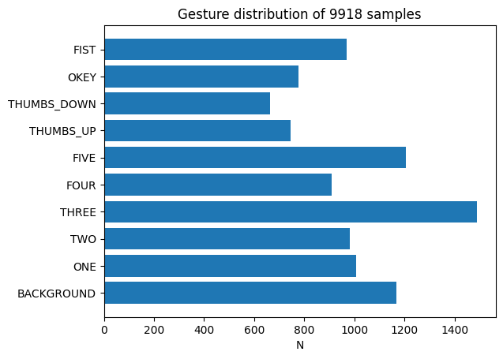
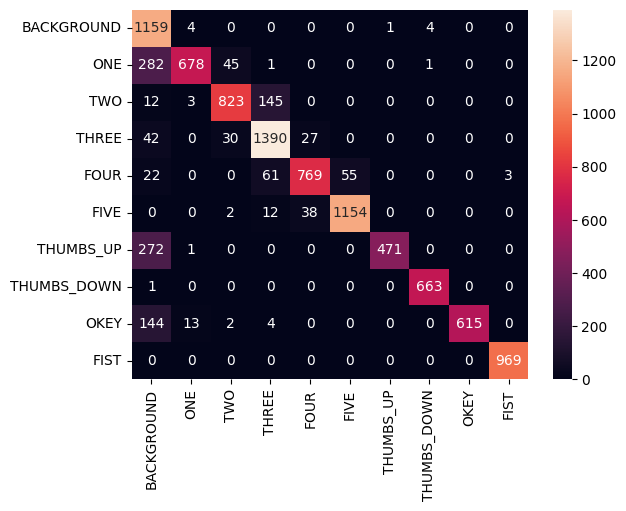
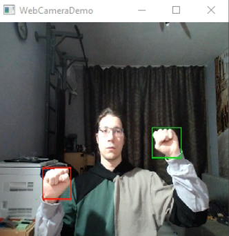
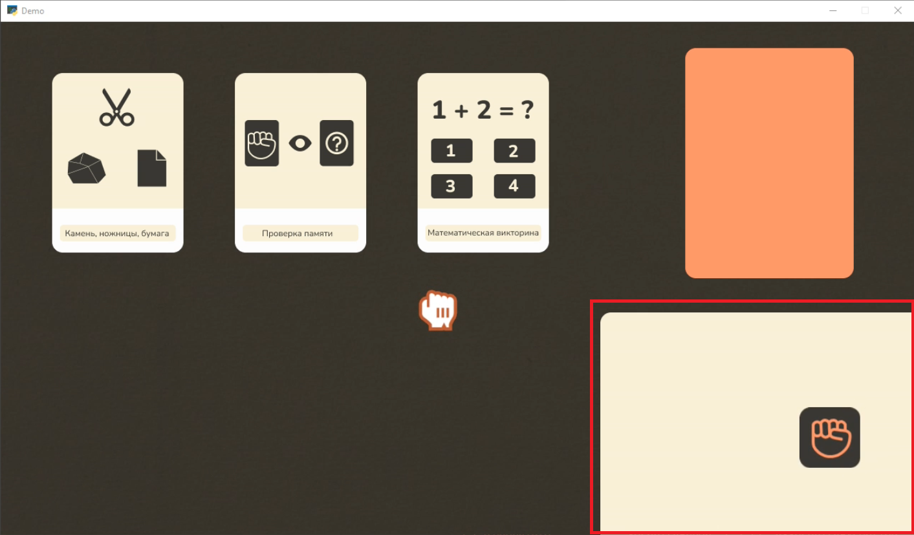

# Реализация ИТМО проекта MyFirstDataProject

# Инструкция по запуску приложения

Для запуска приложения необходима камера

```bash
git clone https://github.com/LongAryaITMOMyFirstDataProject.git
cd ITMOMyFirstDataProject
xhost +local:* 
docker build -t itmo_mvp .
docker run -it --device=/dev/video0:/dev/video0 -v /tmp/.X11-unix:/tmp/.X11-unix -e DISPLAY=$DISPLAY --network host itmo_mvp bash
python3 ./mvp_entry_point.py
```

# Описание модулей приложения

## Модуль обучения классификатора

Основной функционал для обучения классификатора расположен в папке static_gesture_classification. Обучение модели было реализовано с помощью бибилиотеки pytorch-lightning. Lightning module для задачи классификации расположен в файле static_gesture_classification/static_gesture_classifer.py.
Скрипт запуска обучения расположен в корне проекта в файле train_static_gestures.py.

## Модуль MVP

Реализация приложения расположена в папке MVP. MVP это GUI приложение с набором миниигр, управляемых жестами, реализованное c помощью библиотеки arcade.

# Модели

В проекте используется 2 модели: детектор кистей рук и классификатор жестов

## Детектор

В качестве детектора используется предобученная модель YoloV7 из репозитория https://github.com/hukenovs/hagrid

Данная модель была протестирована на подвыборке датасета hagrid, содержащей 1800 снимков людей, показывающих жесты в разных условиях. Были получены следующие метрики:

| metric       | value  |
| ------------ | ------ |
| map@0.5:0.95 | 0.7218 |
| map@0.5      | 0.9328 |
| map@0.75     | 0.8642 |

## Классификатор

В качестве классификатора обучалась модель resnet18, результаты экспериментов доступны по [ссылке](https://app.neptune.ai/longarya/StaticGestureClassification/runs/table?viewId=98f483ca-a116-4e81-b3b7-5c1077f3bd4f&detailsTab=dashboard&dashboardId=98ec2178-7296-4c52-8235-3c905b10e27d&shortId=STAT-98)

### Данные

В качестве данных использовались:

+ Датасет [HANDS](https://www.sciencedirect.com/science/article/pii/S2352340921000755)
+ Датасет [hagrid](https://github.com/hukenovs/hagrid)
+ Самостоятельно сгенерированные данные, для покрытия некоторых ракурсов

Итоговая валидационная выборка составила 9918 семплов жестов, распределение жестов в валидационной выборке:  

<Details>  



</Details>  

### Эксперименты

В ходе работы расширялся набор данных для покрытия ошибок, также для борьбы с неравномерным распределением классов в обучающей выборке использовалась функция ошибки Focal loss, с различными значениями параметра $\gamma$. Запуски с Focall loss в neptune отмечены тегом loss_focal. Для оценки моделей использовался взвешенный f1 score по классам.

Наибольшее значении метрики weighted f1 score = 0.878495 было достигнуто в [этом](https://app.neptune.ai/longarya/StaticGestureClassification/runs/details?viewId=98f483ca-a116-4e81-b3b7-5c1077f3bd4f&detailsTab=metadata&shortId=STAT-91&type=run&lbViewUnpacked=true&sortBy=%5B%22training%2Fval_weighted_F1%22%5D&sortFieldType=%5B%22floatSeries%22%5D&sortFieldAggregationMode=%5B%22max%22%5D&sortDirection=%5B%22descending%22%5D&suggestionsEnabled=true&query=((%60sys%2Ftags%60%3AstringSet%20CONTAINS%20%22valid_run%22))) эксперименте на 49 эпохе.
Далее представлена матрица ошибок  

<Details>  

  

</Details>  

### Воспроизводимость

Для воспроизводимости экспериментов все параметры обучения были зафиксированы в конфиги формата yaml. Для работы с конфигами использовалась библиотека hydra. Для каждого эксперимента значения его конфигов сохранены в neptune и доступны в дашборде Configuration.

# Работа с приложением.

При запуске приложения открывается 2 окна, OpenCV превью веб камеры и игровое меню.  Управление осуществляется жестами активной руки, активной рукой считается самая верхняя. На превью OpenCV отрисовываются все детекции рук, при этом активная отмечена зеленым цветом, а остальные красным.  

<Details>  

  

</Details>  

В игре в левом нижнем углу расположена миниатюра веб камеры, с пиктограмой жеста активной руки (область выделенная красным).  

<Details>  

  
</Details>  


Для выбора игры зажмите активную ладонь в кулак и двигая ей переместите курсор на карточку с выбранной игрой, а затем разожмите кулак.